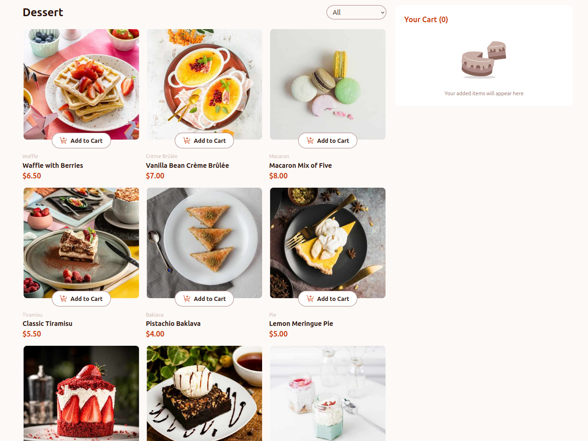

# Frontend Mentor - Product list with cart solution

This is a solution to the [Product list with cart challenge on Frontend Mentor](https://www.frontendmentor.io/challenges/product-list-with-cart-5MmqLVAp_d). Frontend Mentor challenges help you improve your coding skills by building realistic projects.

## Table of contents

- [Overview](#overview)
  - [The challenge](#the-challenge)
  - [Screenshot](#screenshot)
  - [Links](#links)
- [My process](#my-process)
  - [Built with](#built-with)
  - [What I learned](#what-i-learned)
  - [Continued development](#continued-development)
  - [Useful resources](#useful-resources)
- [Author](#author)
- [Acknowledgments](#acknowledgments)

## Overview

### The challenge

Users are able to:

- Add items to the cart and remove them
- Increase/decrease the number of items in the cart
- See an order confirmation modal when they click "Confirm Order"
- Reset their selections when they click "Start New Order"
- View the optimal layout for the interface depending on their device's screen size
- See hover and focus states for all interactive elements on the page

### Screenshot



### Links

- Solution URL: [frontend mentor](https://your-solution-url.com)
- Live Site URL: [vercel](https://your-live-site-url.com)

## My process

### Built with

- CSS Grid
- Mobile-first workflow
- [React](https://reactjs.org/) - JS library
- [Tailwind CSS](https://tailwindcss.com/) - For styles
- [Vite](https://vitejs.dev/) - Build tool
- [TypeScript](https://www.typescriptlang.org/) - For type safety

### What I learned

I learned how to efficiently manage state in a React application using `useState` and how to work with the context API to share state across components. I also learned how to use `useMemo` to optimize performance by memoizing expensive calculations and preventing unnecessary re-renders without forgetting the `useEffect` hook. in addition, I practiced writing clean and maintainable code by breaking down the application into smaller components and using hooks effectively.

```jsx
useEffect(() => {
  const handleEscape = (event: KeyboardEvent) => {
    if (event.key === "Escape") {
      onCloseModal();
    }
  };

  if (isOpen) {
    document.addEventListener("keydown", handleEscape);
    document.body.style.overflow = "hidden";
  }

  return () => {
    document.removeEventListener("keydown", handleEscape);
    document.body.style.overflow = "unset";
  };
}, [isOpen, onCloseModal]);
```

```jsx
const filteredData = useMemo(() => {
  if (selectedCategory === "all") {
    return data;
  }
  return data.filter(
    (product) =>
      product.category.toLowerCase() === selectedCategory.toLowerCase()
  );
}, [selectedCategory, data]);

const handleFilterChange = (category: string) => {
  setSelectedCategory(category);
};
```

### Continued development

I plan to continue developing my skills in React and TypeScript by building more complex applications. I also want to learn how to add unit tests to my React components using vitest or Jest.

## Author

- Frontend Mentor - [@Mohammed-Nedjima](https://www.frontendmentor.io/profile/Mohammed-Nedjima)
- LinkedIn - [Mohammed Ayoub Nedjima](https://www.linkedin.com/in/mohammed-ayoub-nedjima/)
